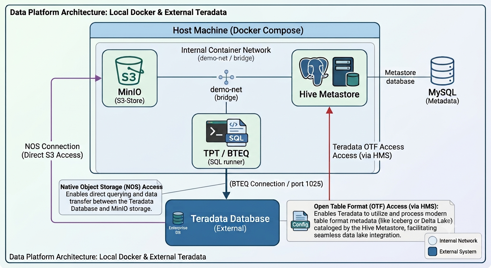

# Teradata Local Lakehouse with Hive Metastore

A Docker Compose-based development environment for building a local data lakehouse using Teradata, Apache Hive metastore, and MinIO (S3-compatible object storage).

## Overview

This project provides a containerized lakehouse foundation that integrates:
- **Teradata Database** — External relational database (configured via `.env`)
- **MinIO** — S3-compatible object storage for data lake files
- **Hive Metastore** — MySQL-backed metadata repository for cataloging data lake tables
- **TTU (Teradata Tools & Utilities)** — Tools and scripts for efficient data movement between systems including Teradata Parallel Transporter (TPT) and Teradata BTEQ

## Prerequisites

- **Docker & Docker Compose** — [Install Docker](https://docs.docker.com/get-docker/)
- **Python 3.9+** with pip — for the data generation and Iceberg setup scripts
- **Teradata Database** — Running externally (on-premises, cloud, or VM)
- **Host Machine IP** — Accessible from the Teradata system (for NOS foreign tables and OTF)


## Running the Demo

See [docs/demo-walkthrough.md](docs/demo-walkthrough.md) for a full explanation of each demo step, what objects are created, and what to look for in the output.

```bash
./run_demo.sh    # run the full demo end-to-end
./reset_demo.sh  # tear down and re-run cleanly
```

## Teradata Express setup

If you are using [**Teradata Express (TDExpress v20)**](https://downloads.teradata.com/download/database/teradata-express/vmware) as the Teradata instance, additional one-time configuration is required to enable Open Table Format (OTF) support for Demos 05–06.

See [docs/setup-td-express-20.md](docs/setup-td-express-20.md) for the full configuration guide, including:

- OTF feature flags (`JavaOTFFlags`, `NativeOTFFlags`, `DisableMOTF`, `ColumnarPurchased`)
- NOS / object storage flags (HTTP mode, path-style S3 addressing)
- Optimizer and pipeline performance flags
- Step-by-step `dbscontrol` commands and validation queries

## Quick Start

### 1. Clone & Configure

```bash
# Copy environment template
cp .env.example .env

# Edit with your settings
nano .env  # or your preferred editor
```

### 2. Set Required Variables in `.env`

```env
# Docker host IP (reachable from Teradata — find with: ip addr show | grep '192.168')
HOST_IP=<your-docker-host-ip>

# Teradata credentials (external database)
TD_HOST=<your-teradata-host>
TD_USER=<your-username>
TD_PASSWORD=<your-password>
TD_DATABASE=lakehouse_demo

# MinIO credentials (optional, defaults provided)
MINIO_ROOT_USER=minioadmin
MINIO_ROOT_PASSWORD=minioadmin

# MySQL for Hive metastore (required)
MYSQL_ROOT_PASSWORD=<your-root-password>
```

**Note:** See `.env.example` for all available configuration options.

### 3. Install Python Dependencies

```bash
pip install -r requirements.txt
```

### 4. Start Services

Start MinIO and supporting services only:
```bash
docker compose up -d minio minio-init
```

Start all services (MinIO, Hive Metastore, MySQL, TPT):
```bash
docker compose up -d
```

Verify services are running:
```bash
docker compose ps
```

Stop all services:
```bash
docker compose down
```

## Service Details

### MinIO (S3-Compatible Object Store)

**Purpose:** Provides S3-compatible storage for lakehouse data files.

- **API Endpoint:** `http://localhost:9000` (or configured `MINIO_API_PORT`)
- **Console UI:** `http://localhost:9001` (or configured `MINIO_CONSOLE_PORT`)
- **Default Credentials:** minioadmin / minioadmin
- **Storage Location:** Docker volume `minio-data:/data`

### Hive Metastore

**Purpose:** Catalogs all data lake tables and schemas.

- **Backend:** MySQL database (`metastore` schema)
- **Default Credentials:** hive / hive
- **Hostname:** `mysql` (within Docker network)

### MySQL (Hive Backend)

**Purpose:** Stores Hive metastore metadata.

- **Service Name:** `mysql`
- **Default Credentials:** root / configured password, hive / hive
- **Database:** `metastore`

### TTU (Teradata Tools & Utilities)

**Purpose:** Provides the `bteq` binary used to run all Teradata SQL scripts. Started automatically by `run_demo.sh`.

- **Image:** `teradata/tpt:latest`
- **Volumes:** `./tpt/tbuild`, `./tpt/scripts`, `./data` (mounted into container)
- **Note:** Requires `accept_license: "Y"` environment variable

## Architecture



## Project Structure

```
.
├── README.md                    # This file
├── docker-compose.yml           # Docker services definition
├── .env.example                 # Environment variables template
├── .env                         # Local configuration (git-ignored)
├── requirements.txt             # Python dependencies
├── run_demo.sh                  # End-to-end demo runner
├── reset_demo.sh                # Tear down and reset for re-run
├── docker/
│   └── hive-metastore/          # Custom Hive Metastore image
│       ├── Dockerfile
│       └── hive-site.xml
├── docs/
│   ├── demo-walkthrough.md      # Step-by-step demo explanation
│   └── setup-td-express-20.md  # TDExpress OTF configuration guide
├── scripts/
│   ├── generate_data.py         # Generates Parquet data → MinIO
│   └── create_iceberg.py        # Creates Iceberg table in Hive Metastore
├── sql/teradata/                # BTEQ scripts (run in order by run_demo.sh)
│   ├── 00_setup_database.sql
│   ├── 01_nos_authorization.sql
│   ├── 02_nos_foreign_table.sql
│   ├── 03_nos_read_validation.sql
│   ├── 04_nos_writeback.sql
│   ├── 05_otf_setup.sql
│   └── 06_otf_read_validation.sql
├── data/                        # Local data staging (mounted into TPT container)
└── tpt/                         # TPT scripts and build artefacts (mounted into TPT container)
```

## Common Tasks

### View MinIO Console

```bash
open http://localhost:9001
# Or navigate to http://<your-host>:9001
```

### Check Service Logs

```bash
# All services
docker compose logs -f

# Specific service
docker compose logs -f minio
docker compose logs -f mysql
```

### Access Hive Metastore Database

```bash
docker compose exec mysql mysql -u hive -p metastore
# When prompted for password, enter: hive
```

### Stop Individual Service

```bash
docker compose stop minio
```

### Reset the Demo

Drop all Teradata objects and MinIO data so the demo can be re-run cleanly:

```bash
./reset_demo.sh
```

### Full Environment Teardown

Remove all containers and volumes (deletes all MinIO and MySQL data):

```bash
docker compose down -v
docker compose up -d
```

## Networking

- **Network Name:** `demo-net` (bridge)
- **Services communicate** internally by hostname (e.g., `mysql`, `minio-server`)
- **External access** via localhost and configured ports
- **Teradata connectivity** uses `HOST_IP` environment variable for NOS foreign tables

## Logging

- Default logging driver: `json-file`
- Max log size: 10MB per file
- Max log files: 3 per service

## Troubleshooting

### MinIO health check fails
```bash
# Check MinIO container logs
docker compose logs minio

# Restart MinIO
docker compose restart minio
```

### Cannot connect to Teradata
- Verify `TD_HOST`, `TD_USER`, `TD_PASSWORD` in `.env`
- Ensure Teradata system can reach `HOST_IP` on your Docker host
- Check firewall rules between systems

### Hive metastore connection issues
- Verify MySQL is running: `docker compose ps mysql`
- Check MySQL logs: `docker compose logs mysql`
- Restart MySQL: `docker compose restart mysql`

## Environment Variables Reference

| Variable | Required | Default | Description |
|----------|----------|---------|-------------|
| `HOST_IP` | ✓ | — | Docker host IP (reachable from Teradata) |
| `TD_HOST` | ✓ | — | Teradata database hostname/IP |
| `TD_USER` | ✓ | — | Teradata username |
| `TD_PASSWORD` | ✓ | — | Teradata password |
| `TD_DATABASE` | — | lakehouse_demo | Teradata database name |
| `MINIO_ROOT_USER` | — | minioadmin | MinIO admin username |
| `MINIO_ROOT_PASSWORD` | — | minioadmin | MinIO admin password |
| `MINIO_API_PORT` | — | 9000 | MinIO API port |
| `MINIO_CONSOLE_PORT` | — | 9001 | MinIO console port |
| `HIVE_DB_HOSTNAME` | — | mysql | Hive metastore database hostname |
| `HIVE_DB_NAME` | — | metastore | Hive metastore database name |
| `HIVE_DB_USER` | — | hive | Hive metastore database user |
| `HIVE_DB_PASSWORD` | — | hive | Hive metastore database password |
| `MYSQL_ROOT_PASSWORD` | ✓ | — | MySQL root password |
| `MYSQL_DATABASE` | — | metastore | MySQL database name |
| `MYSQL_USER` | — | hive | MySQL hive user |
| `MYSQL_PASSWORD` | — | hive | MySQL hive password |

## License

[Add your license information here]

## Support

For issues or questions, refer to the Docker Compose logs or consult the Teradata and Hive documentation.
